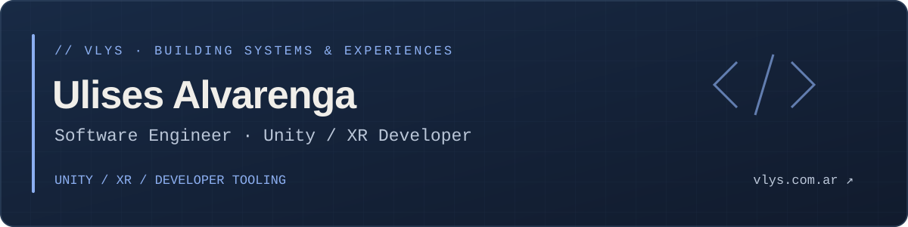

## `// about`

I build **Unity and VR experiences**, gameplay systems, and tools that make development easier. My personal projects also explore Android apps, desktop workspaces, and interactive 3D visualization.

Based in **Argentina**. Focused on **Unity, C#, XR/VR, and developer tooling** — from domain rules and state machines to the interfaces people use.

**[Explore my work at vlys.com.ar →](https://vlys.com.ar)**

## `// stack`

### Unity & XR

### Android

### Web & desktop

### Languages & data

## `// selected projects`

| Project | Engineering focus | Explore |
| :--- | :--- | :--- |
| **Git Branch Visualizer** | Interactive 3D Git history, branch topology, commit inspection, and timeline playback. **React · TypeScript · Three.js** | [Source](https://github.com/Ulysses-Alv/git-branch-visualizer) · [Live demo ↗](https://ulysses-alv.github.io/git-branch-visualizer/) |
| **FitApp** | Local-first workout tracking, estimated 1RM, personal records, and progression analytics. **Kotlin · Compose · Firebase** | [Showcase](https://github.com/Ulysses-Alv/fitApp-public) · [APK releases ↗](https://github.com/Ulysses-Alv/fitApp-public/releases) |
| **Unity Agent Expert** | Go CLI for installing and managing Unity-focused AI agent configurations, with backups, dry runs, and health checks. **Go · OpenCode** | [Source ↗](https://github.com/Ulysses-Alv/Unity-Agent-Expert) |
| **Unity Log Analyzer** | Browser-based log analysis, error grouping, event slicing, Web Workers, and Markdown export. **JavaScript · Python parity checks** | [Source ↗](https://github.com/Ulysses-Alv/log_splitter) |
| **OpenCode Subagent Monitor** | Desktop companion consuming session state produced by the upstream sub-agent-statusline plugin. **Rust · Tauri · TypeScript** | [Source ↗](https://github.com/Ulysses-Alv/opencode-subagent-watcher) |

FitApp's public repository contains its showcase and releases; the application source is private.

## `// engineering interests`

- **Gameplay & XR** — interaction systems, state machines, editor tooling, and URP rendering.
- **Application architecture** — domain modeling, local-first data, persistence, and automated testing.
- **Developer experience** — debugging utilities, visualizations, and AI-assisted workflows.

I use AI tools throughout development, alongside explicit requirements, code review, testing, and manual validation. I enjoy turning problems from my own workflow into usable software.

---

<strong>More projects, more context, and contact details</strong> 
<a href="https://vlys.com.ar"><strong>vlys.com.ar ↗</strong></a>

